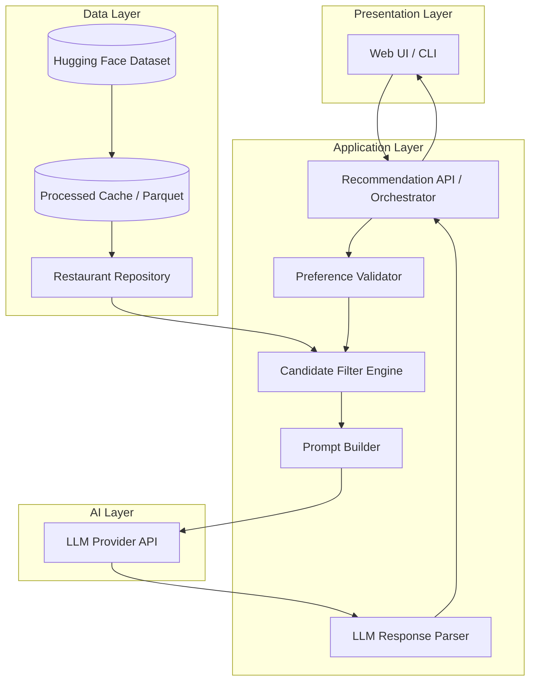
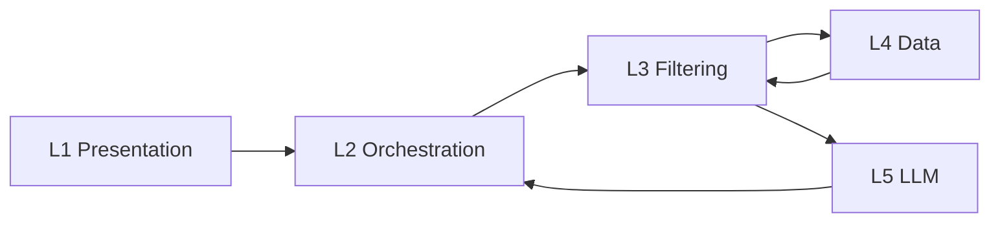
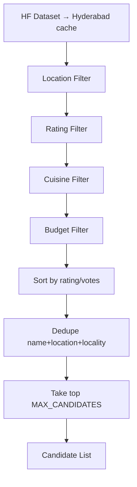
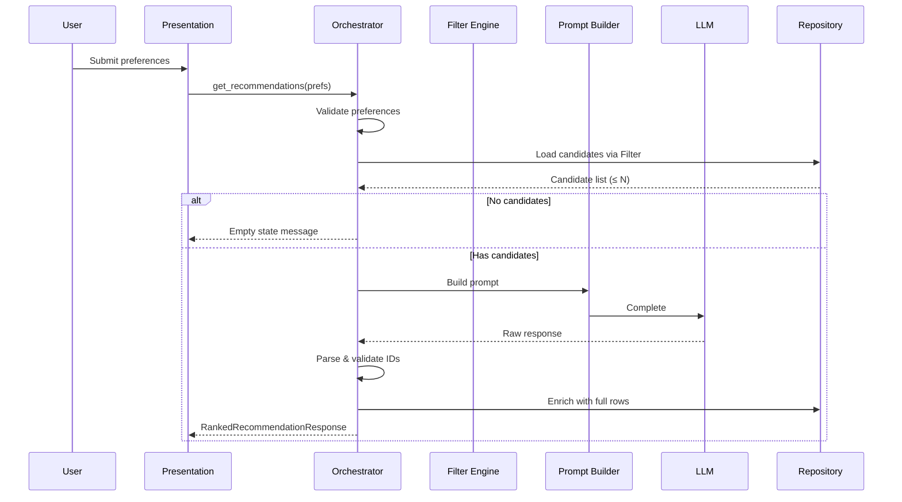
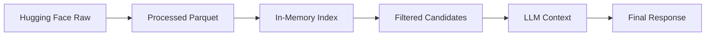
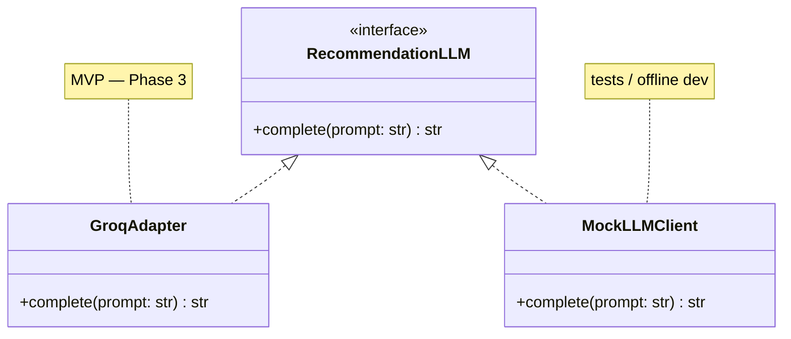
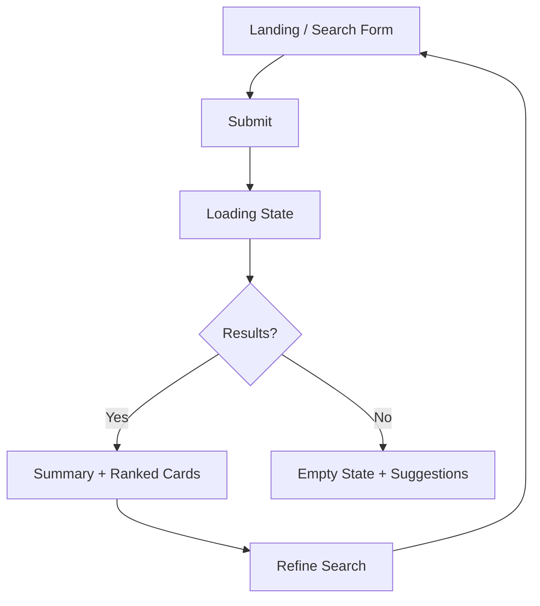
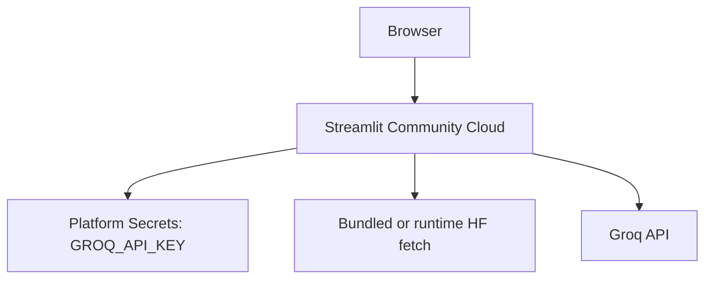

# System Architecture: AI-Powered Restaurant Recommendation System

> **Derived from:** [context.md](./context.md)  
> **Project:** Zomato-inspired recommendation service  
> **Last updated:** 2026-05-22

---

## Table of Contents

1. [Architecture Goals](#architecture-goals)
2. [High-Level Overview](#high-level-overview)
3. [Logical Architecture](#logical-architecture)
4. [Component Design](#component-design)
5. [Data Architecture](#data-architecture)
6. [Request & Data Flow](#request--data-flow)
7. [Filtering & Candidate Selection](#filtering--candidate-selection)
8. [LLM Integration Architecture](#llm-integration-architecture)
9. [Presentation Layer](#presentation-layer)
10. [Suggested Project Structure](#suggested-project-structure)
11. [Technology Stack (Recommended)](#technology-stack-recommended)
12. [Non-Functional Requirements](#non-functional-requirements)
13. [Failure Modes & Mitigations](#failure-modes--mitigations)
14. [Security & Configuration](#security--configuration)
15. [Deployment Topology](#deployment-topology)
16. [Future Extensions](#future-extensions)

---

## Architecture Goals

| Goal | How the architecture supports it |
|------|----------------------------------|
| **Grounded recommendations** | Only dataset-backed restaurants enter the LLM prompt; outputs are validated against candidate IDs/names |
| **Personalization** | User preferences drive deterministic pre-filtering and LLM ranking context |
| **Human-readable output** | LLM produces per-restaurant explanations and optional summary |
| **Maintainability** | Clear separation: data pipeline, business rules, LLM orchestration, UI |
| **Scalability (MVP)** | In-memory or cached dataset; async LLM calls; bounded candidate sets |

---

## High-Level Overview

The system follows a **hybrid retrieval + generation** pattern:

1. **Retrieval (structured):** Rule-based filtering over the cached restaurant store (Hyderabad by default) narrows to a small candidate set.
2. **Generation (LLM):** The model ranks candidates and writes natural-language explanations—without inventing new restaurants.



---

## Logical Architecture

Five cooperating layers map directly to the workflow in [context.md](./context.md):

| Layer | Responsibility | Key outputs |
|-------|----------------|-------------|
| **L1 — Presentation** | Collect preferences; render ranked results | `UserPreferences`, `RecommendationView[]` |
| **L2 — Application / Orchestration** | End-to-end request lifecycle, validation, error handling | `RecommendationResponse` |
| **L3 — Domain / Filtering** | Apply business rules; select candidates | `RestaurantCandidate[]` |
| **L4 — Data** | Load, clean, normalize, persist dataset | `Restaurant` entities |
| **L5 — AI / LLM** | Prompt, invoke model, parse structured + narrative output | `RankedRecommendation[]` |



**Design principle:** The LLM never sees the full cached dataset—only a **bounded candidate list** (e.g., 15–30 rows) produced by L3.

---

## Component Design

### 1. Data Ingestion Service

**Purpose:** One-time or scheduled load from Hugging Face into an application-ready store.

| Concern | Design decision |
|---------|-----------------|
| Source (default) | [`shambhuraje/Swiggy_Vs_Zomato`](https://huggingface.co/datasets/shambhuraje/Swiggy_Vs_Zomato) via `datasets` — multi-city; **ingestion keeps `Hyderabad` only** (`DATA_METRO_FILTER`) |
| Legacy source | `ManikaSaini/zomato-restaurant-recommendation` (~51,717 rows, Bangalore-only URLs) — still supported in `ingestion.py` |
| Volume (cache) | ~240 Hyderabad restaurants after filter (from ~2.5k multi-city HF rows) |
| Processing | Schema detection (Swiggy vs Zomato CSV), null handling, metro filter, dedupe by chain |
| Persistence | Local Parquet cache (`data/processed/restaurants.parquet`) |
| Refresh | `python scripts/download_dataset.py --force` |
| Default metro | `DEFAULT_METRO_CITY=Hyderabad` for UI and docs |

**Pipeline stages:**

```
Raw HF rows → Schema mapping → Cleaning → Normalization → Indexed store
```

**Normalized fields (minimum):**

- `id` — stable row identifier
- `name` — restaurant name
- `location` / `city` — geographic filter
- `cuisines` — string or list (split on delimiter if needed)
- `rating` — numeric (handle `/5` or invalid values)
- `cost_for_two` or `approx_cost` — numeric or bucketed
- `votes`, `address`, `rest_type` — optional for richer prompts

---

### 2. Restaurant Repository

**Purpose:** Abstract access to processed restaurant data.

**Interface (conceptual):**

```python
class RestaurantRepository:
    def load() -> None: ...
    def get_all() -> list[Restaurant]: ...
    def filter(criteria: FilterCriteria) -> list[Restaurant]: ...
    def get_by_ids(ids: list[str]) -> list[Restaurant]: ...
```

**Implementation options:**

| Option | Pros | Cons |
|--------|------|------|
| In-memory `pandas` DataFrame | Simple, fast for MVP | RAM ~574 MB acceptable on dev machines |
| SQLite + indexes on city, cuisine | Queryable, persistent | Extra setup |
| Parquet + lazy load | Fast cold start after first process | Slightly more code |

**Recommendation for MVP:** Load Parquet once at startup into a DataFrame; filter in-process.

---

### 3. Preference Handler

**Purpose:** Validate and normalize user input before filtering.

**Input schema:**

| Field | Type | Validation |
|-------|------|------------|
| `location` | string | Required; match against known cities/locations in dataset |
| `budget` | enum | `low` \| `medium` \| `high` |
| `cuisine` | string | Optional; fuzzy match against cuisine tokens |
| `min_rating` | float | Optional; 0–5 |
| `additional_preferences` | string | Free text (family-friendly, quick service, etc.) |

**Budget mapping (example — tune from dataset distribution):**

| Budget | Cost for two (INR) |
|--------|---------------------|
| low | &lt; 500 |
| medium | 500 – 1500 |
| high | &gt; 1500 |

Values should be derived from dataset percentiles during ingestion, not hard-coded blindly.

---

### 4. Candidate Filter Engine

**Purpose:** Deterministic narrowing before LLM invocation.

**Filter pipeline (ordered):**

1. **Location** — exact or case-insensitive match on city/location column
2. **Minimum rating** — `rating >= min_rating`
3. **Cuisine** — substring or token match in `cuisines` field
4. **Budget** — map enum to cost range
5. **Sort** — when cuisine is set, sort by **cuisine relevance** (primary match first), then rating/votes; otherwise rating/votes only
6. **Dedupe chains** — one row per `(name, location, locality)`; keep best-rated branch (DAT-04)
7. **Cap** — take top `MAX_CANDIDATES` (e.g., 25)



**Empty result handling:** Return user-facing message suggesting broader criteria; do not call LLM.

---

### 5. Prompt Builder

**Purpose:** Construct a structured, grounded prompt for the LLM.

**Prompt structure:**

1. **System instructions** — rank only from provided list; no invented restaurants; JSON or structured output format
2. **User preferences** — serialized preferences object
3. **Candidate table** — compact JSON/array of allowed restaurants with id, name, cuisine, rating, cost
4. **Task** — rank top K, explain each, optional summary

**Grounding rules embedded in prompt:**

- Every recommended `id` must exist in the candidate list
- Explanations must reference user-stated preferences
- If no strong match, say so honestly

---

### 6. LLM Recommendation Engine

**Purpose:** Rank, explain, and optionally summarize candidates.

**MVP provider:** [Groq](https://console.groq.com/) — fast hosted inference via the official `groq` Python SDK and chat-completions API. Phase 3 implements a **Groq adapter** only; other providers remain behind the same interface for future swaps.

**Responsibilities:**

| Task | Owner |
|------|-------|
| HTTP/API call to provider | Groq LLM client adapter (`src/llm/client.py`) |
| Retry on transient failures | Orchestrator |
| Parse model output | Response parser |
| Validate IDs against candidates | Post-processor |
| Merge LLM narrative with structured rows | Enrichment service |

**Output contract (recommended JSON schema):**

```json
{
  "summary": "Optional overview of recommendations for Delhi, Italian, medium budget.",
  "recommendations": [
    {
      "restaurant_id": "12345",
      "rank": 1,
      "explanation": "Strong Italian menu, 4.5 rating, fits medium budget..."
    }
  ]
}
```

**Post-processing:**

- Drop any `restaurant_id` not in candidate set
- Dedupe by `restaurant_id` **and** by `(name, location, locality)` so chain branches do not repeat in the UI
- Join with repository for display fields (name, cuisine, rating, cost)
- Backfill to `TOP_K_RESULTS` from deduped candidates if the LLM returns fewer unique picks
- Fill display template for UI

---

### 7. Recommendation Orchestrator

**Purpose:** Single entry point coordinating the full flow.



---

### 8. Output Formatter / View Model

**Purpose:** Map domain objects to UI-ready cards.

**Per recommendation card:**

| Field | Source |
|-------|--------|
| Restaurant name | Repository |
| Cuisine | Repository |
| Rating | Repository |
| Estimated cost | Repository |
| AI explanation | LLM output |
| Rank | LLM output |

---

## Data Architecture

### Entity: Restaurant

```
Restaurant {
  id: string
  name: string
  location: string
  cuisines: string[]      // normalized from raw field
  rating: float
  approx_cost: int        // or cost_for_two
  votes?: int
  address?: string
  rest_type?: string
}
```

### Entity: UserPreferences

```
UserPreferences {
  location: string
  budget: "low" | "medium" | "high"
  cuisine?: string
  min_rating?: float
  additional_preferences?: string
}
```

### Entity: RankedRecommendation (API response)

```
RankedRecommendation {
  rank: int
  restaurant: Restaurant
  explanation: string
}
RecommendationResponse {
  summary?: string
  recommendations: RankedRecommendation[]
  metadata: { candidate_count, filters_applied }
}
```

### Data lineage



---

## Request & Data Flow

### End-to-end flow (happy path)

```
1. User opens app → optional dataset warmup (background load)
2. User submits form (location, budget, cuisine, rating, extras)
3. Orchestrator validates input
4. Filter engine queries repository → 0–25 candidates
5. Prompt builder serializes candidates + preferences
6. LLM returns ranked list + explanations (+ summary)
7. Parser validates restaurant IDs
8. Enricher joins LLM output with repository fields
9. UI renders recommendation cards
```

### Latency budget (MVP targets)

| Stage | Target |
|-------|--------|
| Filter (in-memory) | &lt; 200 ms |
| LLM call | 2–15 s (provider-dependent) |
| Parse + enrich | &lt; 50 ms |
| **Total perceived** | Show loading state during LLM |

---

## Filtering & Candidate Selection

### Why pre-filter before LLM?

| Reason | Detail |
|--------|--------|
| **Cost** | Smaller prompts = fewer tokens |
| **Accuracy** | Model focuses on relevant subset |
| **Grounding** | Smaller ID set → easier validation |
| **Latency** | Less context to process |

### Configuration parameters

| Parameter | Suggested default | Notes |
|-----------|-------------------|-------|
| `MAX_CANDIDATES` | 25 | Sent to LLM |
| `TOP_K_RESULTS` | 5 | Shown to user |
| `MIN_CANDIDATES_FOR_LLM` | 1 | Skip LLM if zero |

### Additional preferences handling

Free-text fields (e.g., "family-friendly", "quick service") are passed to the **LLM prompt only**, not used in strict SQL-like filters unless dataset has matching columns. The model uses them for ranking rationale.

---

## LLM Integration Architecture

### Adapter pattern

Phase 3 ships **one concrete adapter: Groq**. The `RecommendationLLM` interface keeps orchestration and tests provider-agnostic (`MockLLMClient` for CI).



**Future providers** (not in MVP): OpenAI, Anthropic, Ollama — add new adapters implementing `RecommendationLLM`; set `LLM_PROVIDER` in `.env`.

| Setting | MVP value |
|---------|-----------|
| `LLM_PROVIDER` | `groq` |
| `GROQ_API_KEY` | From [Groq Console](https://console.groq.com/keys) |
| `LLM_MODEL` | e.g. `llama-3.3-70b-versatile` or `llama-3.1-8b-instant` |
| `LLM_TEMPERATURE` | 0.2–0.5 |
| `LLM_TIMEOUT` | 30–60 s |

Swap models or providers via environment variables without changing orchestration logic.

### Prompt strategy

| Strategy | Description |
|----------|-------------|
| **Structured output** | Request JSON; parse with schema validation |
| **Few-shot** | Include 1 example ranking in system prompt |
| **Temperature** | Low (0.2–0.5) for consistent ranking |
| **Max tokens** | Cap explanations to control cost |

### Anti-hallucination measures

1. Provide explicit candidate IDs in prompt
2. Instruct: "Only recommend from the list below"
3. Post-validate every returned ID
4. Dedupe duplicate chain rows before the LLM sees candidates (ingestion + filter pipeline)
5. On parse failure, retry once with stricter JSON instruction
6. Fallback: return filter-sorted top K with template explanation (degraded mode)

---

## Presentation Layer

### Option A: Streamlit (legacy MVP)

- Single Python codebase at `src/app/main.py`
- Form widgets for preferences; cards for results with spinner during LLM call

### Option B: Next.js website + FastAPI (implemented)

- **Frontend:** `frontend/` — Next.js 14, React, TypeScript, Tailwind (Gourmet Intelligence / Stitch design)
- **API:** `src/api/main.py` — `GET /api/config`, `GET /api/locations`, `POST /api/recommendations`
- Frontend decoupled; better for demos/portfolio

### UI wireflow



**Form fields (aligned with context):**

- Location (dropdown from dataset cities or autocomplete)
- Budget (radio: low / medium / high)
- Cuisine (text or dropdown)
- Minimum rating (slider)
- Additional preferences (textarea)

---

## Suggested Project Structure

```
zomato-recommd/
├── Docs/
│   ├── context.md
│   ├── architecture.md
│   └── problemStatement.txt
├── data/
│   └── processed/          # cached parquet (gitignored)
├── src/
│   ├── config/
│   │   └── settings.py     # env, MAX_CANDIDATES, API keys
│   ├── data/
│   │   ├── ingestion.py    # HF load + preprocess
│   │   ├── models.py       # Restaurant, UserPreferences
│   │   └── repository.py
│   ├── domain/
│   │   ├── filters.py      # FilterCriteria, pipeline
│   │   └── budget.py       # budget → cost mapping
│   ├── llm/
│   │   ├── client.py       # adapter interface
│   │   ├── prompts.py
│   │   └── parser.py
│   ├── services/
│   │   └── orchestrator.py
│   └── app/
│       ├── main.py         # Streamlit or FastAPI entry
│       └── schemas.py      # API DTOs
├── scripts/
│   └── download_dataset.py
├── tests/
│   ├── test_filters.py
│   └── test_parser.py
├── .env.example
├── requirements.txt
└── README.md
```

---

## Technology Stack (Recommended)

| Concern | Recommendation | Rationale |
|---------|----------------|-----------|
| Language | Python 3.10+ | HF `datasets`, pandas, rich LLM SDKs |
| Dataset | `datasets`, `pandas` | Native Hugging Face integration |
| UI (MVP) | Streamlit | Rapid form + results |
| API (alt) | FastAPI | If separating frontend |
| LLM | **Groq** (MVP); adapter interface for future providers | Fast inference; free tier friendly for demos |
| LLM SDK | `groq` | Official Groq Python client |
| Config | `pydantic-settings` + `.env` | API keys, model name |
| Cache | Parquet on disk | Faster restarts |

Stack is **not mandated** by the problem statement; choices above optimize for speed of delivery and alignment with [context.md](./context.md).

---

## Non-Functional Requirements

| NFR | Target |
|-----|--------|
| **Correctness** | 100% of displayed restaurants exist in dataset |
| **Availability** | Single-user / demo; no HA required for MVP |
| **Performance** | Filter &lt; 200 ms; total flow dominated by LLM |
| **Observability** | Log filter counts, prompt size, LLM latency, parse errors |
| **Testability** | Unit tests for filters and parser; mock LLM in integration tests |

---

## Failure Modes & Mitigations

| Failure | Mitigation |
|---------|------------|
| HF download fails | Ship sample Parquet; document manual download |
| No restaurants match filters | User message; suggest relaxing cuisine/budget/rating |
| LLM timeout / rate limit | Retry with backoff; show friendly error |
| Invalid JSON from LLM | Retry with "JSON only"; fallback to rule-based top K |
| Hallucinated restaurant ID | Strip invalid IDs; re-rank remaining |
| Missing `GROQ_API_KEY` | Fail fast at startup with clear `.env` instructions |

---

## Security & Configuration

| Item | Practice |
|------|----------|
| LLM API keys | `.env` only; never commit; `.env.example` in repo |
| User input | Sanitize strings; max length on `additional_preferences` |
| Dataset | Public HF data; no PII handling required for MVP |
| Network | HTTPS for hosted deployments; local dev HTTP acceptable |

**Environment variables (example):**

```
# Phase 3+ — Groq (MVP)
LLM_PROVIDER=groq
GROQ_API_KEY=gsk_...
LLM_MODEL=llama-3.3-70b-versatile
LLM_TEMPERATURE=0.3
LLM_MAX_TOKENS=2000
LLM_TIMEOUT=60

MAX_CANDIDATES=25
TOP_K_RESULTS=5
DATA_CACHE_PATH=./data/processed/restaurants.parquet
```

---

## Deployment Topology

### Local development

```
Developer machine
  └── Streamlit / FastAPI (localhost)
  └── Parquet cache + HF download on first run
  └── LLM via Groq cloud API
```

### Demo / portfolio hosting



**Note:** ~574 MB dataset may require pre-processed Parquet bundled or downloaded once at cold start—document storage implications for free tiers.

---

## Future Extensions

Out of scope for MVP per [context.md](./context.md), but architecture allows:

- **Vector search** — semantic match on cuisines/descriptions before LLM
- **User accounts** — save preference profiles
- **Caching recommendations** — Redis keyed by preference hash
- **A/B testing** — compare prompt variants
- **Evaluation harness** — relevance scoring, hallucination rate metrics
- **Real Zomato API** — replace static dataset with live data adapter implementing same `RestaurantRepository` interface

---

## Architecture ↔ Context Traceability

| Context requirement | Architecture section |
|-----------------------|----------------------|
| Hugging Face dataset load | Data Ingestion Service, Data Architecture |
| User preferences (location, budget, cuisine, rating, extras) | Preference Handler, Presentation Layer |
| Filter before LLM | Candidate Filter Engine |
| LLM rank + explain + summarize (Groq MVP) | LLM Recommendation Engine, Prompt Builder |
| Output: name, cuisine, rating, cost, explanation | Output Formatter, RankedRecommendation entity |
| Grounded, non-hallucinated results | Anti-hallucination measures, Post-processing |
| No auth / payments / live Zomato API | Out of scope; Future Extensions |

---

## Summary

The system is architected as a **layered, hybrid RAG-style pipeline**: structured filtering over the Zomato Hugging Face dataset produces a small, verifiable candidate set; an LLM ranks and explains only those candidates; the presentation layer renders enriched, user-friendly cards. Separation of concerns across data, domain, AI, and UI keeps the design testable, swappable (LLM provider, UI framework), and aligned with project success criteria defined in [context.md](./context.md).
