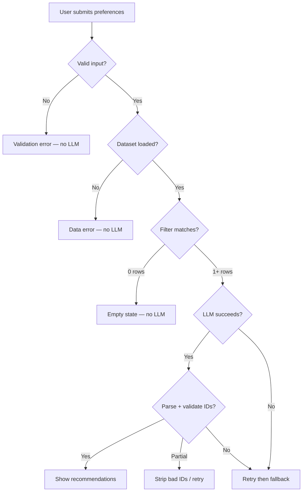
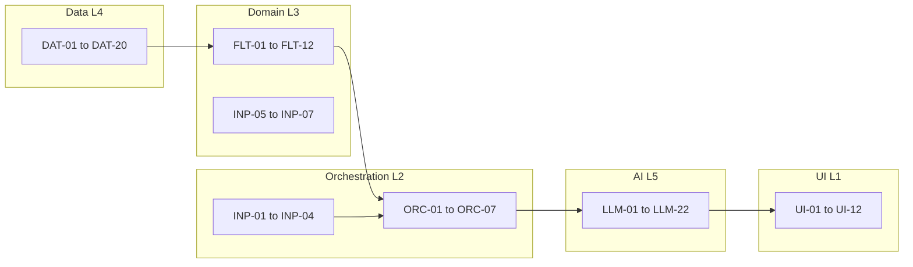

# Edge Cases & Handling Guide

> **Based on:** [context.md](./context.md) · [architecture.md](./architecture.md) · [implementation-plan.md](./implementation-plan.md)  
> **Purpose:** Catalog edge cases, expected behavior, mitigations, and test IDs for QA  
> **Last updated:** 2026-05-20

---

## How to Use This Document

| Column | Meaning |
|--------|---------|
| **ID** | Unique reference for tests and issue tracking |
| **Severity** | `Critical` (breaks correctness/trust) · `High` (bad UX or cost) · `Medium` · `Low` |
| **Layer** | Where the case is detected/handled |
| **User message** | Copy shown in UI (if applicable) |

**Implementation rule:** Every `Critical` case must have code-level handling—not documentation only.

---

## Quick Reference: Decision Flow



---

## 1. Configuration & Environment

| ID | Scenario | Severity | Expected behavior | Implementation | User message |
|----|----------|----------|-------------------|----------------|--------------|
| CFG-01 | `.env` file missing | Critical | Fail fast on app start or first LLM call | Check `OPENAI_API_KEY` (or provider key) in `settings`; raise `ConfigurationError` | "API key not configured. Copy `.env.example` to `.env` and add your key." |
| CFG-02 | API key empty or whitespace | Critical | Same as CFG-01 | Strip and validate non-empty | Same as CFG-01 |
| CFG-03 | Invalid `LLM_PROVIDER` value | High | Fall back to default provider or fail with list of valid options | Enum validation in `settings.py` | "Unknown LLM provider. Supported: openai, anthropic, ollama." |
| CFG-04 | `MAX_CANDIDATES` = 0 or negative | High | Use default 25 | `max(1, min(value, 50))` clamp | N/A (internal) |
| CFG-05 | `TOP_K_RESULTS` > `MAX_CANDIDATES` | Medium | Clamp `TOP_K` to `MAX_CANDIDATES` | Settings validation on load | N/A |
| CFG-06 | `DATA_CACHE_PATH` points to missing file | Critical | Trigger download script or show setup instructions | Check file exists; offer `scripts/download_dataset.py` hint | "Restaurant data not found. Run: `python scripts/download_dataset.py`" |
| CFG-07 | Corrupt / truncated Parquet file | Critical | Delete cache and re-run ingestion | Try/catch on `read_parquet`; log path | "Data file corrupted. Re-downloading dataset…" |
| CFG-08 | Wrong model name for provider | High | Surface API error clearly | Catch provider 404/model errors | "Model not available. Check LLM_MODEL in .env." |

---

## 2. Data Ingestion & Repository (L4)

| ID | Scenario | Severity | Expected behavior | Implementation | User message |
|----|----------|----------|-------------------|----------------|--------------|
| DAT-01 | Hugging Face download timeout / network error | Critical | Retry 3× with backoff; then use local cache if exists | `tenacity` or manual retry in `download_dataset.py` | "Could not download dataset. Check internet or use cached data." |
| DAT-02 | HF dataset schema changed (column rename) | Critical | Ingestion fails with explicit column map error | Schema assertion step after load; document in `ingestion.py` | N/A (dev-facing log) |
| DAT-03 | Empty dataset returned (0 rows) | Critical | Abort startup; do not run app | Assert `len(df) > 0` after load | "Dataset is empty. Cannot start recommendation service." |
| DAT-04 | Duplicate restaurant rows | Medium | Deduplicate by `name + location` or keep first | `drop_duplicates` in ingestion | N/A |
| DAT-05 | Missing `rating` (null / NaN) | High | Exclude from rating filter OR treat as 0 | Filter: `rating >= min` excludes nulls; document behavior | N/A |
| DAT-06 | Rating as string `"4.5/5"` or `"-"` | High | Parse to float; invalid → `None` | Regex strip `/5`; coerce failures to null | N/A |
| DAT-07 | Rating out of range (e.g. 6.2, -1) | Medium | Clamp to [0, 5] or drop row | `clip(0, 5)` or exclude | N/A |
| DAT-08 | Missing `approx_cost` / `cost_for_two` | High | Exclude from budget filter only; still eligible if other filters pass | Budget filter skips rows with null cost | N/A |
| DAT-09 | Cost as string `"1,200"` or `"₹500"` | High | Strip currency/commas; parse int | Normalization in ingestion | N/A |
| DAT-10 | Cost = 0 or negative | Medium | Treat as missing or exclude from budget band | Set to `None` if ≤ 0 | N/A |
| DAT-11 | Empty `name` | Medium | Drop row or assign placeholder ID only | Drop before cache write | N/A |
| DAT-12 | `cuisines` null or empty string | Medium | Set `cuisines = ["Unknown"]` or exclude from cuisine filter | Normalization | N/A |
| DAT-13 | Multi-cuisine string `"North Indian, Chinese, Italian"` | Low | Split on `,`; trim tokens | `cuisines.split(",")` | N/A |
| DAT-14 | Location spelling variants (`"Bengaluru"` vs `"Bangalore"`) | High | Alias map or fuzzy city normalization | Maintain `CITY_ALIASES` dict in ingestion | UI: show canonical names only |
| DAT-15 | Location with extra whitespace / mixed case | Low | `strip().title()` or lowercase compare | Normalize on ingest and filter | N/A |
| DAT-16 | Very long `address` field | Low | Truncate in LLM prompt only (e.g. 100 chars) | Prompt builder | N/A |
| DAT-17 | Insufficient RAM to load full DataFrame | High | Document minimum RAM; optional city subset for demo | README; optional `DEMO_MODE` env | "Running in demo mode (subset of cities)." |
| DAT-18 | Parquet older than HF dataset version | Low | Warn in logs; manual refresh via script | Optional file mtime check | N/A |
| DAT-19 | `get_by_ids()` returns fewer rows than requested | High | Omit missing IDs from output; log warning | Orchestrator enrichment | N/A |
| DAT-20 | ID type mismatch (int vs str in LLM JSON) | High | Coerce all IDs to `str` before compare | `str(restaurant_id)` everywhere | N/A |

---

## 3. User Input & Validation (L1 / L2)

| ID | Scenario | Severity | Expected behavior | Implementation | User message |
|----|----------|----------|-------------------|----------------|--------------|
| INP-01 | Location not selected / empty | Critical | Block submit; validation error | Pydantic `location: str` min_length=1; Streamlit required | "Please select a location." |
| INP-02 | Location not in dataset (typos, free text) | High | Reject if using dropdown; if text allowed, fuzzy match or suggest closest | Validate against `get_available_locations()` | "Location not found. Did you mean: Bangalore?" |
| INP-03 | Budget not selected | Critical | Default to `medium` OR require selection | Form default or validation | N/A or "Please select a budget." |
| INP-04 | Invalid budget enum (API tampering) | High | 400 / validation error | Pydantic `Literal["low","medium","high"]` | "Invalid budget value." |
| INP-05 | Cuisine empty string | Low | Treat as "any cuisine" — skip cuisine filter | `if not cuisine.strip(): skip` | N/A |
| INP-06 | Cuisine with only special characters (`"!!!"`) | Medium | Skip filter or no matches | Same as empty; optional warning | "Cuisine not recognized; showing all cuisines in location." |
| INP-07 | Cuisine very long (> 200 chars) | Medium | Truncate to max length | `additional_preferences` max 500; cuisine max 100 | "Input truncated to maximum length." |
| INP-08 | `min_rating` not provided | Low | No rating filter applied | Optional field | N/A |
| INP-09 | `min_rating` = 0 | Low | Allow all ratings including null handling per DAT-05 | Filter only if > 0 | N/A |
| INP-10 | `min_rating` = 5.0 | Medium | Very few results; valid | No special case | Empty state if no match |
| INP-11 | `min_rating` > 5 or < 0 | High | Clamp to [0, 5] or reject | Slider 0–5 in UI; validator in API | "Rating must be between 0 and 5." |
| INP-12 | `min_rating` non-numeric (API) | High | Validation error | Pydantic `float` | "Invalid rating." |
| INP-13 | `additional_preferences` empty | Low | Omit from prompt section | Conditional in prompt builder | N/A |
| INP-14 | `additional_preferences` very long (> 500 chars) | Medium | Truncate; warn user | `[:500]` + log | "Additional notes were shortened." |
| INP-15 | Prompt injection in free text (`"Ignore previous instructions"`) | High | Sanitize; system prompt reinforces grounding | Strip control chars; strong system prompt | N/A (no special UI) |
| INP-16 | Unicode / emoji in preferences | Low | Accept if UTF-8; pass to LLM | No ASCII-only restriction | N/A |
| INP-17 | Double submit / rapid clicks | Medium | Disable button during request | `st.session_state.loading` | "Finding recommendations…" |
| INP-18 | Session refresh mid-request | Medium | Idempotent; show error if state lost | Handle `Streamlit` rerun | "Request interrupted. Please search again." |

---

## 4. Filtering & Candidate Selection (L3)

| ID | Scenario | Severity | Expected behavior | Implementation | User message |
|----|----------|----------|-------------------|----------------|--------------|
| FLT-01 | Zero restaurants match all filters | Critical | **Do not call LLM**; return empty response with suggestions | Early return in orchestrator | See [Empty state copy](#empty-state-copy) |
| FLT-02 | Only 1 restaurant matches | Medium | Send 1 candidate to LLM; return 1 card | Allow `TOP_K=1` | N/A |
| FLT-03 | Matches > `MAX_CANDIDATES` (e.g. 200) | Low | Sort by rating/votes; cap at 25 | Sort + `head(MAX_CANDIDATES)` | N/A |
| FLT-04 | All matches have null rating but `min_rating` set | High | Empty set → FLT-01 | Exclude nulls in rating filter | Same as FLT-01 |
| FLT-05 | All matches have null cost but budget filter set | High | Empty or relax budget in suggestion text | Exclude null costs for budget | "Try a different budget or remove cuisine filter." |
| FLT-06 | Cuisine substring false positive (`"sin"` matches `"Chinese"`) | Medium | Word-boundary or token match preferred | Split cuisines; match whole token | N/A |
| FLT-07 | Cuisine case mismatch (`"italian"` vs `"Italian"`) | Low | Case-insensitive match | `.lower()` on both sides | N/A |
| FLT-08 | Budget band edge (exactly 500 INR) | Medium | Document inclusive/exclusive bounds | Consistent `<=` / `<` in `budget.py` | N/A |
| FLT-09 | Location filter too strict (neighborhood vs city) | Medium | Match city column only for MVP | Document column used | Suggest broader location in empty state |
| FLT-10 | Optional filters all omitted (only location + budget) | Low | Valid; may return many candidates then cap | Normal path | N/A |
| FLT-11 | Conflicting prefs (high budget + low cost band empty) | Medium | Empty → FLT-01 | No special logic | Empty state copy |
| FLT-12 | Filter completes in > 200 ms (slow machine) | Low | Still correct; log warning | Performance log | N/A |

### Empty state copy

Use when **FLT-01** (zero candidates):

```text
No restaurants match your criteria in our dataset.

Try:
• Lowering the minimum rating
• Choosing a broader cuisine (or leave blank)
• Switching budget to medium or high
• Picking a larger city from the list
```

---

## 5. LLM Integration (L5)

| ID | Scenario | Severity | Expected behavior | Implementation | User message |
|----|----------|----------|-------------------|----------------|--------------|
| LLM-01 | API timeout (> 30s) | High | Retry 1×; then fallback or error | `timeout=30`; backoff | "Recommendation service timed out. Please try again." |
| LLM-02 | Rate limit (429) | High | Exponential backoff; max 3 retries | Catch `RateLimitError` | "Service busy. Wait a moment and retry." |
| LLM-03 | Invalid API key (401) | Critical | Fail; no retry | Catch auth errors | "Invalid API key. Check your .env configuration." |
| LLM-04 | Insufficient quota / billing | High | Clear error | Provider error message pass-through | "API quota exceeded. Check your provider account." |
| LLM-05 | Model returns empty string | High | Retry once; then fallback | Empty check on response | N/A |
| LLM-06 | Model returns markdown JSON fence | Low | Strip ` ```json ` before parse | Parser regex | N/A |
| LLM-07 | Model returns invalid JSON | High | Retry with "JSON only, no markdown" | Second prompt variant | N/A |
| LLM-08 | Model returns JSON missing `recommendations` key | High | Retry; then fallback | Schema validation | N/A |
| LLM-09 | Model returns fewer than `TOP_K` items | Medium | Show what was returned; no padding with fake rows | Display `len(results)` | N/A |
| LLM-10 | Model returns more than `TOP_K` items | Low | Truncate to `TOP_K` after validation | `[:TOP_K]` | N/A |
| LLM-11 | **Hallucinated `restaurant_id`** not in candidates | Critical | **Drop** invalid IDs; log | Set intersection check | N/A |
| LLM-12 | Duplicate ranks (two `rank: 1`) | Medium | Re-number sequentially after sort | Post-process ranks | N/A |
| LLM-13 | Duplicate same `restaurant_id` twice | Medium | Keep first occurrence | Dedupe by id | N/A |
| LLM-14 | Valid ID but explanation empty | Medium | Template: "Matches your preferences for {location}." | Default explanation string | N/A |
| LLM-15 | `summary` field missing | Low | Omit summary section in UI | Optional field | N/A |
| LLM-16 | `summary` contradicts recommendations | Medium | Show summary with disclaimer OR hide | Product choice; prefer hide if inconsistent | N/A |
| LLM-17 | Model invents restaurant **name** in explanation only | Medium | Display name from repository only, never from LLM | Enrichment overwrites name | N/A |
| LLM-18 | All returned IDs invalid after validation | Critical | Full fallback to rule-based top K | `fallback_rank(candidates)` | "Showing top-rated matches (AI summary unavailable)." |
| LLM-19 | Prompt exceeds token limit | High | Reduce candidate fields in prompt; fewer candidates | Compact JSON; truncate address | N/A |
| LLM-20 | Ollama / local model offline | High | Clear error if provider=ollama | Connection check | "Local LLM not running." |
| LLM-21 | Temperature causes unstable rankings | Low | Use low temperature 0.2–0.5 | Config | N/A |
| LLM-22 | `additional_preferences` irrelevant to dataset | Low | LLM may still reason; no crash | Prompt only | N/A |

### Fallback ranking (degraded mode)

When LLM fails after retry (**LLM-07, LLM-08, LLM-18**):

1. Sort candidates by `rating` desc, then `votes` desc  
2. Take top `TOP_K_RESULTS`  
3. Explanation template: `"Highly rated in {location} with {rating} stars, matching your {budget} budget."`  
4. Set `metadata.degraded_mode = true`

---

## 6. Orchestration & Enrichment (L2)

| ID | Scenario | Severity | Expected behavior | Implementation | User message |
|----|----------|----------|-------------------|----------------|--------------|
| ORC-01 | Exception in filter stage | Critical | Catch; return error response; no LLM | try/except in orchestrator | "Something went wrong while searching. Please try again." |
| ORC-02 | Exception in LLM stage after valid candidates | High | Fallback per LLM-18 | try/except around `client.complete` | Degraded message |
| ORC-03 | Partial enrichment (3 valid IDs, 2 invalid) | High | Show 3 cards; log 2 dropped | Continue with valid subset | N/A |
| ORC-04 | LLM returns valid ID but row deleted from cache | Medium | Skip card; log | `get_by_ids` miss | N/A |
| ORC-05 | Concurrent requests (two tabs) | Low | Each independent; no shared mutable state | Stateless orchestrator | N/A |
| ORC-06 | `candidate_count` metadata wrong | Low | Set from `len(candidates)` pre-LLM | Accurate metadata | N/A |
| ORC-07 | Circular dependency / import error at startup | Critical | Fail fast with import error | CI smoke test | N/A |

---

## 7. Presentation Layer (L1)

| ID | Scenario | Severity | Expected behavior | Implementation | User message |
|----|----------|----------|-------------------|----------------|--------------|
| UI-01 | Dataset still loading on first paint | High | Show spinner; block form submit | `@st.cache_resource` + loading flag | "Loading restaurant data…" |
| UI-02 | Dataset load failed | Critical | Show error panel; no form | try/except on repository load | "Failed to load data. See README for setup." |
| UI-03 | Location dropdown empty (no cities) | Critical | Block app; data issue | Assert len(locations) > 0 | Same as UI-02 |
| UI-04 | Very long restaurant name in card | Low | Truncate with ellipsis | CSS / `[:80]` | N/A |
| UI-05 | `approx_cost` null in display | Medium | Show "Cost not available" | Null-safe formatting | "Cost not available" |
| UI-06 | Rating null in display | Medium | Show "No rating" | Null-safe | "No rating" |
| UI-07 | Explanation contains markdown from LLM | Low | Render as plain text or safe markdown | `st.markdown` vs `st.text` | N/A |
| UI-08 | Zero results empty state | High | Show FLT-01 copy; hide cards | Conditional render | Empty state copy |
| UI-09 | Degraded mode results | Medium | Small info banner | `st.info` if `degraded_mode` | "AI ranking unavailable — showing top-rated picks." |
| UI-10 | Streamlit rerun clears results | Low | Results in `session_state` until new search | `st.session_state.results` | N/A |
| UI-11 | Mobile narrow viewport | Low | Stack cards vertically | Streamlit default | N/A |
| UI-12 | User changes form after results shown | Low | Old results stay until new submit | Clear on submit | N/A |

---

## 8. Security & Abuse

| ID | Scenario | Severity | Expected behavior | Implementation | User message |
|----|----------|----------|-------------------|----------------|--------------|
| SEC-01 | API key committed to git | Critical | Pre-commit / docs; rotate key | `.gitignore`; never log key | N/A |
| SEC-02 | API key logged in exception traceback | Critical | Redact in logging filter | Custom log formatter | N/A |
| SEC-03 | Extremely large POST body (if API added) | Medium | Reject > 10 KB | FastAPI limit | "Request too large." |
| SEC-04 | SQL injection | N/A | No SQL in MVP | pandas only | N/A |
| SEC-05 | XSS via LLM explanation in HTML UI | Medium | Escape HTML if rendering raw | `st.text` preferred | N/A |
| SEC-06 | Automated scraping / spam requests | Low | Out of scope for MVP | Rate limit future | N/A |

---

## 9. Deployment & Operations

| ID | Scenario | Severity | Expected behavior | Implementation | User message |
|----|----------|----------|-------------------|----------------|--------------|
| OPS-01 | Cold start exceeds Streamlit timeout | High | Bundle pre-built Parquet; lazy LLM | Smaller cache file for cloud | "Starting up…" |
| OPS-02 | Cloud secret not injected | Critical | Same as CFG-01 | Platform secrets docs | CFG-01 message |
| OPS-03 | Disk full during Parquet write | Critical | Catch IOError; instruct cleanup | try/except on write | "Disk full. Free space and retry download." |
| OPS-04 | Read-only filesystem on PaaS | High | Use `/tmp` or bundled data path | Env-specific `DATA_CACHE_PATH` | N/A |
| OPS-05 | Hugging Face unreachable in production | High | Ship Parquet in release artifact | CI build step | N/A |
| OPS-06 | LLM region blocked | High | Document VPN/provider region | README | "API unavailable in your region." |

---

## 10. Cross-Cutting & Data Quality

| ID | Scenario | Severity | Expected behavior | Implementation | User message |
|----|----------|----------|-------------------|----------------|--------------|
| X-01 | Same user prefs as previous search | Low | New LLM call (no cache MVP) | Stateless | N/A |
| X-02 | Dataset has single-city dominance | Low | Other cities may empty often | Document in demo scenarios | Empty state |
| X-03 | "Quick service" in extras but no column | Low | LLM-only reasoning | Per architecture | N/A |
| X-04 | Ties in rating/votes sort | Low | Stable sort by `id` secondary | `kind="mergesort"` | N/A |
| X-05 | Scientific notation in cost field | Low | Parse float then int | `float()` then `int()` | N/A |
| X-06 | Test with `MockLLMClient` returns bad JSON | Low | Tests assert fallback | `tests/test_parser.py` | N/A |

---

## Priority Matrix for Implementation

| Priority | IDs | Action |
|----------|-----|--------|
| **P0 — Must ship** | CFG-01, CFG-06, DAT-01, DAT-05–09, FLT-01, INP-01, LLM-11, LLM-18, ORC-03, UI-02, UI-08 | Implement before demo |
| **P1 — Should ship** | LLM-01–04, LLM-07, INP-02, INP-15, DAT-14, FLT-05, UI-09, SEC-01–02 | Phase 6 hardening |
| **P2 — Nice to have** | Remaining IDs | Backlog / post-MVP |

---

## Test Case Mapping

Add these to `tests/` or manual QA checklist:

| Test file | Covers IDs |
|-----------|------------|
| `tests/test_filters.py` | FLT-01–12, DAT-05–10 (fixture data) |
| `tests/test_parser.py` | LLM-06–08, LLM-11–14, LLM-20 |
| `tests/test_orchestrator.py` | ORC-01–04, LLM-18, FLT-01 |
| `tests/test_validation.py` | INP-01–12, CFG-04–05 |
| Manual `Docs/demo-scenarios.md` | UI-08, FLT-01, LLM-22, X-02 |

### Sample pytest parametrization

```python
# Example: FLT-01 empty filter
@pytest.mark.parametrize("prefs,expected_count", [
    (UserPreferences(location="Delhi", budget="high", cuisine="Martian", min_rating=5.0), 0),
])
def test_empty_filter_returns_zero(prefs, expected_count, repository):
    result = filter_engine.apply(repository, prefs)
    assert len(result) == expected_count
```

---

## Logging & Observability (All Layers)

| Event | Log level | Fields |
|-------|-----------|--------|
| Filter returned 0 | INFO | `location`, `filters` |
| Filter returned N | INFO | `candidate_count`, `duration_ms` |
| LLM call start/end | INFO | `latency_ms`, `provider`, `model` |
| Invalid ID dropped | WARNING | `restaurant_id`, `valid_ids_sample` |
| JSON parse failure | WARNING | `raw_response[:500]` |
| Fallback triggered | WARNING | `reason` |
| Config error | ERROR | `missing_var` (never log secrets) |

---

## Edge Case → Layer Handler Map



---

## Related Documents

| Document | Link |
|----------|------|
| Success criteria | [context.md](./context.md) |
| Component ownership | [architecture.md](./architecture.md) §13 Failure Modes |
| When to implement | [implementation-plan.md](./implementation-plan.md) Phase 6 |
| Demo scenarios | Create `demo-scenarios.md` from P0 test matrix |

---

## Changelog

| Date | Change |
|------|--------|
| 2026-05-20 | Initial catalog: 90+ edge cases across 10 categories |
