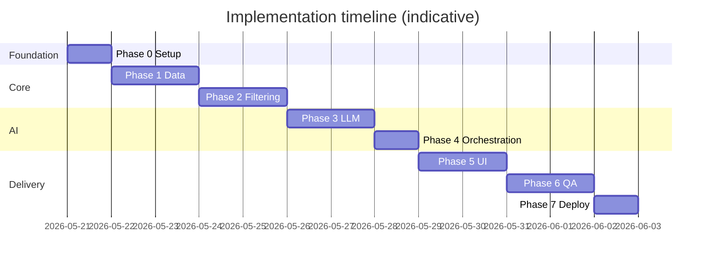
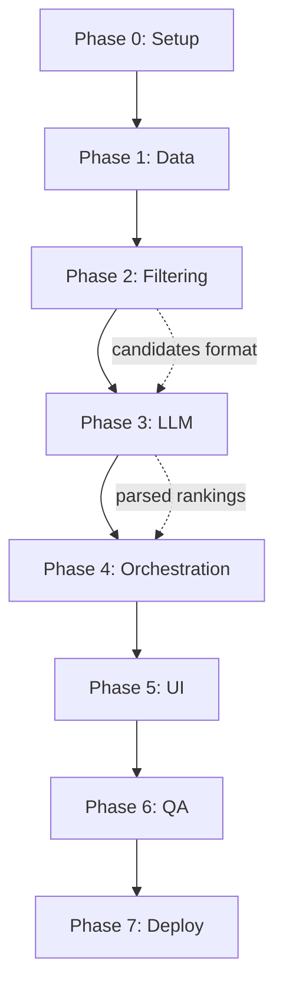

# Phase-Wise Implementation Plan

> **Based on:** [architecture.md](./architecture.md) · [context.md](./context.md)  
> **Project:** AI-Powered Restaurant Recommendation System (Zomato use case)  
> **Last updated:** 2026-05-22

---

## Executive Summary

| Phase | Name | Architecture layer(s) | Est. duration |
|-------|------|------------------------|---------------|
| **0** | Foundation & setup | — | 0.5–1 day |
| **1** | Data pipeline | L4 — Data | 1–2 days |
| **2** | Domain & filtering | L3 — Domain | 1–2 days |
| **3** | LLM integration | L5 — AI | 1–2 days |
| **4** | Orchestration | L2 — Application | 1 day |
| **5** | Presentation (UI) | L1 — Presentation | 1–2 days |
| **6** | Testing & hardening | All | 1–2 days |
| **7** | Deployment (optional) | Ops | 0.5–1 day |

**Total MVP estimate:** ~7–12 working days (solo developer, part-time friendly).

**Delivery model:** Each phase ends with a **verifiable demo or artifact** before moving on. Phases 1–4 can be validated via CLI/scripts; Phase 5 delivers the user-facing app.



---

## Success Criteria (from context)

Use these as **final acceptance** checks across all phases:

- [ ] Recommendations use **only real dataset rows** (no hallucinated restaurants)
- [ ] Output is **personalized** to location, budget, cuisine, rating, and extras
- [ ] Each result shows **name, cuisine, rating, cost, AI explanation**
- [ ] LLM **ranks**, **explains**, and optionally **summarizes**
- [ ] Empty filter results handled without calling the LLM

---

## Phase 0: Foundation & Project Setup

**Goal:** Runnable repo skeleton, dependencies, configuration, and documentation baseline.

**Maps to:** Architecture §10 (project structure), §11 (tech stack), §14 (security)

### Tasks

| # | Task | Details |
|---|------|---------|
| 0.1 | Initialize repository structure | Create folders per `architecture.md`: `src/`, `data/processed/`, `scripts/`, `tests/` |
| 0.2 | Python environment | Python 3.10+; `venv`; pin versions in `requirements.txt` |
| 0.3 | Core dependencies | `datasets`, `pandas`, `pyarrow`, `pydantic`, `pydantic-settings`, `python-dotenv` |
| 0.4 | LLM SDK (Phase 3) | `groq` — official Groq Python client (see [architecture.md](./architecture.md) §8) |
| 0.5 | UI dependency | `streamlit` (MVP path per architecture) |
| 0.6 | Configuration module | `src/config/settings.py` — load from `.env`: `LLM_PROVIDER` (`groq`), `GROQ_API_KEY`, `LLM_MODEL`, `LLM_TEMPERATURE`, `LLM_MAX_TOKENS`, `LLM_TIMEOUT`, `MAX_CANDIDATES`, `TOP_K_RESULTS`, `DATA_CACHE_PATH` |
| 0.7 | Environment template | `.env.example` with all variables documented |
| 0.8 | Git hygiene | `.gitignore` for `venv/`, `.env`, `data/processed/*.parquet`, `__pycache__/` |
| 0.9 | README stub | Setup steps: install, download data, configure `GROQ_API_KEY`, run app |

### Deliverables

- [ ] Project tree matches architecture layout
- [ ] `pip install -r requirements.txt` succeeds
- [ ] `settings` loads without error when `.env` is present
- [ ] README lists prerequisites and commands

### Exit criteria

- Developer can clone, install deps, and import `src.config.settings` with no runtime errors.

### Dependencies

- None (first phase).

---

## Phase 1: Data Pipeline (L4 — Data Layer)

**Goal:** Load Hugging Face dataset, preprocess, cache as Parquet, expose via `RestaurantRepository`.

**Maps to:** Context §“Data ingestion”; Architecture §4.1 Data Ingestion, §4.2 Repository, §5 Data Architecture

### Tasks

| # | Task | Details |
|---|------|---------|
| 1.1 | Dataset download script | `scripts/download_dataset.py` — load `shambhuraje/Swiggy_Vs_Zomato` (HF); filter to **Hyderabad** via `DATA_METRO_FILTER` |
| 1.2 | Schema exploration | Inspect raw columns; document mapping to normalized schema |
| 1.3 | Domain models | `src/data/models.py` — `Restaurant`, `UserPreferences` (dataclasses or Pydantic) |
| 1.4 | Cleaning pipeline | `src/data/ingestion.py`: null handling, rating coercion (strip `/5`), cost parsing, cuisine splitting; **dedupe** by `id` then `name + location` (keep best-rated row per chain) |
| 1.5 | Stable IDs | Assign or preserve `id` per row for grounding |
| 1.6 | Location normalization | Standardize city/location strings (trim, case) |
| 1.7 | Budget percentiles | Compute cost distribution; define low/medium/high thresholds in `src/domain/budget.py` |
| 1.8 | Parquet cache | Write `data/processed/restaurants.parquet`; skip re-download if cache exists |
| 1.9 | Repository implementation | `src/data/repository.py`: `load()`, `get_all()`, `get_by_ids()`, basic `filter()` stub |
| 1.10 | City list helper | `get_available_locations()` for UI dropdowns later |
| 1.11 | Smoke test script | Print row count, sample row, unique cities count |

### Deliverables

- [ ] `restaurants.parquet` generated locally (~240 Hyderabad rows from HF)
- [ ] `Restaurant` model with: `id`, `name`, `location`, `cuisines`, `rating`, `approx_cost` (+ optional fields)
- [ ] Repository loads Parquet into memory in &lt; 30s on typical hardware
- [ ] Documented column mapping in code comments or `Docs/data-schema.md` (optional)

### Exit criteria

```text
python scripts/download_dataset.py
→ Parquet exists
→ Repository returns Hyderabad restaurants
→ Sample filter by location "Hyderabad" returns non-empty list
```

### Dependencies

- Phase 0 complete.

### Risks & mitigations

| Risk | Mitigation |
|------|------------|
| HF download slow/fails | Document manual download; ship small `sample.parquet` for CI |
| Column names differ from docs | Adapt mapping in `ingestion.py` after exploration (task 1.2) |
| High RAM usage | Use Parquet + load once; document minimum RAM |

---

## Phase 2: Domain & Filtering (L3 — Domain Layer)

**Goal:** Validate user preferences and deterministically narrow dataset to ≤ `MAX_CANDIDATES` before any LLM call.

**Maps to:** Context §“Integration layer”; Architecture §4.3 Preference Handler, §4.4 Filter Engine, §7 Filtering

### Tasks

| # | Task | Details |
|---|------|---------|
| 2.1 | `FilterCriteria` model | Location, budget, cuisine, min_rating in `src/domain/filters.py` |
| 2.2 | Preference validation | Required `location`; enum `budget`; `min_rating` 0–5; max length on free text |
| 2.3 | Location filter | Case-insensitive match on `location` / city column |
| 2.4 | Rating filter | `rating >= min_rating` when provided |
| 2.5 | Cuisine filter | Token match on `cuisines`; rank by `cuisine_match_score` (primary cuisine first) |
| 2.6 | Budget filter | Map `low` / `medium` / `high` using percentiles from Phase 1 |
| 2.7 | Sort & cap | Sort by `rating` desc, then `votes` desc; take top `MAX_CANDIDATES` (default 25) |
| 2.7b | Chain dedupe | `dedupe_restaurants()` — one candidate per `(name, location, locality)` before cap (fixes duplicate cards; see DAT-04) |
| 2.8 | Empty-result path | Return structured empty response with user-facing suggestions |
| 2.9 | Wire repository | `repository.filter(criteria)` implements full pipeline |
| 2.10 | Unit tests | `tests/test_filters.py` — location, budget, cuisine, rating, cap, empty case |
| 2.11 | CLI probe (optional) | `python -m src.domain.filters --location Delhi --budget medium` prints count |

### Deliverables

- [ ] Filter pipeline runs in &lt; 200 ms on full in-memory dataset
- [ ] Tests pass for happy path and edge cases (no matches, missing optional fields)
- [ ] `additional_preferences` stored on `UserPreferences` but **not** used in SQL-like filters (LLM-only per architecture)

### Exit criteria

```text
Filter Delhi + Italian + medium + min_rating 4.0
→ Returns 1–25 candidates, all matching location
→ Zero-match query returns empty list + does not invoke LLM (verified in Phase 4)
```

### Dependencies

- Phase 1 complete (repository + budget mapping).

---

## Phase 3: LLM Integration (L5 — AI Layer)

**Goal:** Prompt builder, **Groq** LLM adapter, JSON parser, ID validation, and degraded fallback.

**Maps to:** Context §“Recommendation engine”; Architecture §4.5 Prompt Builder, §4.6 LLM Engine, §8 LLM Integration

**Provider (MVP):** [Groq](https://console.groq.com/) — not OpenAI. Use `GROQ_API_KEY` and a Groq-hosted model (e.g. `llama-3.3-70b-versatile`, `llama-3.1-8b-instant`).

### Tasks

| # | Task | Details |
|---|------|---------|
| 3.1 | LLM interface | `src/llm/client.py` — abstract `complete(prompt: str) -> str` |
| 3.2 | Groq adapter | `GroqRecommendationLLM` using `groq` SDK — chat completions; map `RateLimitError` / timeouts per edge-cases |
| 3.3 | System prompt | Rank only from candidate list; JSON output; no invented restaurants |
| 3.4 | Prompt builder | `src/llm/prompts.py` — serialize preferences + candidate JSON table |
| 3.5 | Output schema | `summary`, `recommendations[{restaurant_id, rank, explanation}]` |
| 3.6 | Response parser | `src/llm/parser.py` — extract JSON; handle markdown fences |
| 3.7 | ID validation | Strip `restaurant_id` values not in candidate set; dedupe duplicate IDs in JSON |
| 3.7b | Enrichment dedupe | Orchestrator drops duplicate chain names; backfills to `TOP_K_RESULTS` from deduped candidates |
| 3.8 | Retry logic | One retry on invalid JSON with stricter instructions |
| 3.9 | Degraded fallback | Rule-based top K + template explanation if LLM fails twice |
| 3.10 | Mock client | `MockLLMClient` for tests returning fixed JSON |
| 3.11 | Unit tests | `tests/test_parser.py` — valid JSON, fenced JSON, invalid IDs, malformed response |
| 3.12 | Manual integration test | `scripts/test_llm_integration.py --live` — real Groq API with 3–5 hardcoded candidates |

### Configuration

| Parameter | Default / example |
|-----------|-------------------|
| `LLM_PROVIDER` | `groq` |
| `GROQ_API_KEY` | Required for live calls (Groq Console) |
| `LLM_MODEL` | e.g. `llama-3.3-70b-versatile` |
| `MAX_CANDIDATES` | 25 |
| `TOP_K_RESULTS` | 5 |
| `LLM_TEMPERATURE` | 0.2–0.5 |
| `LLM_MAX_TOKENS` | Cap explanation length / cost |
| `LLM_TIMEOUT` | 30–60 s |

### Deliverables

- [ ] End-to-end LLM call with mock returns parsed `RankedRecommendation` list
- [ ] Live Groq API test produces explanations referencing user prefs
- [ ] Hallucinated IDs removed in post-processing
- [ ] Fallback path documented in README

### Exit criteria

```text
Given 10 candidates + UserPreferences
→ LLM returns JSON with ranks 1..5
→ All restaurant_ids exist in candidate set
→ Parser + validator succeed without exception
```

### Dependencies

- Phase 2 complete (candidate list format stable).
- `GROQ_API_KEY` in `.env` for live tests.

### Risks & mitigations

| Risk | Mitigation |
|------|------------|
| Non-JSON LLM output | Retry + regex extraction + fallback |
| API cost / quota | Prefer smaller Groq models (`llama-3.1-8b-instant`); limit candidates to 25 |
| Rate limits (429) | Exponential backoff in Groq client |
| Invalid / missing `GROQ_API_KEY` | Fail fast with `.env.example` instructions |

---

## Phase 4: Orchestration & Integration (L2 — Application Layer)

**Goal:** Single `get_recommendations()` flow tying filter → prompt → LLM → enrich → response DTO.

**Maps to:** Context full workflow; Architecture §4.7 Orchestrator, §6 Request Flow, §8 Output Formatter

### Tasks

| # | Task | Details |
|---|------|---------|
| 4.1 | Response DTOs | `RecommendationResponse`, `RankedRecommendation`, metadata (`candidate_count`, `filters_applied`) |
| 4.2 | Orchestrator service | `src/services/orchestrator.py` — `get_recommendations(prefs)` |
| 4.3 | Flow implementation | validate → filter → (if empty return) → prompt → LLM → parse → validate IDs → enrich from repository |
| 4.4 | Enrichment | Join LLM output with `Restaurant` fields for display |
| 4.5 | Logging | Log filter count, prompt token estimate, LLM latency, parse errors |
| 4.6 | Error handling | Missing `GROQ_API_KEY` fail-fast; timeout message; empty candidates message |
| 4.7 | Integration test | Mock LLM full pipeline test in `tests/test_orchestrator.py` |
| 4.8 | CLI entry (temporary) | Minimal script to invoke orchestrator from terminal for Phase 5 prep |

### Deliverables

- [ ] One function call produces final `RecommendationResponse`
- [ ] Empty filter short-circuits before LLM
- [ ] All displayed fields populated from repository + LLM

### Exit criteria

```text
CLI: get_recommendations(location="Hyderabad", budget="medium", cuisine="Chinese", min_rating=4.0)
→ JSON/cards with 5 results, each with name, cuisine, rating, cost, explanation
→ metadata.candidate_count > 0
```

### Dependencies

- Phases 1, 2, 3 complete.

---

## Phase 5: Presentation Layer (L1 — UI)

**Goal:** Streamlit app collecting preferences and displaying ranked recommendation cards.

**Maps to:** Context §“User input”, §“Output display”; Architecture §9 Presentation

### Tasks

| # | Task | Details |
|---|------|---------|
| 5.1 | App entry | `src/app/main.py` — Streamlit `st.set_page_config`, title, layout |
| 5.2 | Dataset warmup | `@st.cache_resource` load repository on startup |
| 5.3 | Preference form | Location dropdown (from `get_available_locations()`), budget radio, cuisine text, rating slider, additional prefs textarea |
| 5.4 | Submit handler | Build `UserPreferences`; call orchestrator |
| 5.5 | Loading state | `st.spinner` during LLM call (2–15 s) |
| 5.6 | Results view | Summary (if present) + cards: rank, name, cuisine, rating, cost, explanation |
| 5.7 | Empty state | Friendly message + tips to broaden search |
| 5.8 | Error display | `st.error` for API/config failures |
| 5.9 | Refine search | Clear or adjust form without full page reload issues |
| 5.10 | Optional styling | Columns, expanders, or simple CSS for readability |

### UI field mapping

| Context field | Streamlit widget |
|---------------|------------------|
| Location | `st.selectbox` |
| Budget | `st.radio` (low / medium / high) |
| Cuisine | `st.text_input` |
| Minimum rating | `st.slider` (0.0–5.0) |
| Additional preferences | `st.text_area` |

### Deliverables

- [ ] `streamlit run src/app/main.py` launches app
- [ ] Full happy-path demo recordable (screen capture ready)
- [ ] All success-criteria fields visible on each card

### Exit criteria

Manual test checklist:

- [ ] Submit valid prefs → 5 **distinct** restaurant cards with explanations (no repeated chain names)
- [ ] Impossible filter combo → empty state, no crash
- [ ] Missing `.env` key → clear error at startup or submit

### Dependencies

- Phase 4 complete.

---

## Phase 6: Testing, Hardening & Documentation

**Goal:** Stable MVP meeting context success criteria; reproducible setup for reviewers.

**Maps to:** Architecture §12 NFRs, §13 Failure modes; Context success criteria

### Tasks

| # | Task | Details |
|---|------|---------|
| 6.1 | Unit test coverage | Filters, parser, budget mapping, orchestrator (mocked LLM) |
| 6.2 | Integration test | One golden-path test with `MockLLMClient` |
| 6.3 | Manual test matrix | Document 5–10 scenarios (cities, cuisines, edge cases) |
| 6.4 | Anti-hallucination audit | Verify no result ID outside candidate set across 10 runs |
| 6.5 | Input sanitization | Max length on `additional_preferences`; strip dangerous chars |
| 6.6 | Performance check | Confirm filter &lt; 200 ms; log LLM latency |
| 6.7 | README completion | Install, data download, env vars, run commands, architecture link |
| 6.8 | Demo script | Example preferences that always return good results |
| 6.9 | Code cleanup | Remove debug prints; consistent typing hints |
| 6.10 | Optional: `Docs/demo-scenarios.md` | Curated test cases for evaluators |

### Test matrix (manual)

| # | Scenario | Expected |
|---|----------|----------|
| 1 | Hyderabad + medium + Chinese + rating 4+ | ≥ 1 recommendation |
| 2 | Delhi + low + Italian | Results within budget band |
| 3 | Obscure cuisine + strict rating | Empty state or few results |
| 4 | Only location + budget | Still returns ranked list |
| 5 | additional_preferences = "family-friendly" | Explanation mentions family aspect |
| 6 | Invalid `GROQ_API_KEY` | Clear error |
| 7 | LLM returns bad JSON | Retry or fallback triggers |

### Deliverables

- [ ] `pytest` passes locally
- [ ] README enables third party to run app in &lt; 30 min
- [ ] All context success criteria checked off

### Exit criteria

- MVP ready for submission/demo without developer assistance.

### Dependencies

- Phase 5 complete.

---

## Phase 7: Deployment (Optional)

**Goal:** Hosted demo (e.g. Streamlit Community Cloud) with secrets and cached data strategy.

**Maps to:** Architecture §15 Deployment

### Tasks

| # | Task | Details |
|---|------|---------|
| 7.1 | Pre-built Parquet in release | Avoid 574 MB HF download on cold start OR document one-time bootstrap |
| 7.2 | `requirements.txt` pinned | Reproducible cloud build |
| 7.3 | Streamlit Cloud / similar | Connect repo; set secrets for `GROQ_API_KEY` (and `LLM_PROVIDER=groq`) |
| 7.4 | Health check | App loads dataset and shows form within timeout limits |
| 7.5 | Public URL in README | For portfolio/submission |

### Deliverables

- [ ] Public URL (optional)
- [ ] Deployment notes in README

### Dependencies

- Phase 6 complete.

### Risks

| Risk | Mitigation |
|------|------------|
| Dataset too large for free tier | Ship compressed Parquet subset or top cities only for demo |
| Cold start timeout | Pre-warm cache; reduce startup work |

---

## Phase Dependency Graph



**Parallelization (if team of 2+):**

- After Phase 1: Developer A → Phase 2; Developer B → Phase 3 (mock candidate fixtures).
- Phase 4 requires both streams merged.

---

## Traceability Matrix

| Context / architecture requirement | Phase |
|----------------------------------|-------|
| Load HF Zomato dataset | 1 |
| Extract name, location, cuisine, cost, rating | 1 |
| User prefs: location, budget, cuisine, rating, extras | 2, 5 |
| Filter before LLM | 2 |
| Structured candidates to LLM | 3, 4 |
| LLM rank + explain + summarize (Groq) | 3, 4 |
| Output: name, cuisine, rating, cost, explanation | 4, 5 |
| Grounded (no hallucination) | 3, 6 |
| No auth / payments / live API | Out of scope (7 optional hosting only) |

---

## Milestone Checklist (Project Manager View)

| Milestone | Phases | Demo |
|-----------|--------|------|
| **M1 — Data ready** | 0, 1 | Parquet + repository stats in terminal |
| **M2 — Smart filter** | 2 | CLI prints filtered candidates for Delhi |
| **M3 — AI ranking** | 3, 4 | CLI prints ranked list with explanations |
| **M4 — User app** | 5 | Streamlit end-to-end |
| **M5 — Release ready** | 6 | README + tests green |
| **M6 — Live demo** | 7 | Public URL (optional) |

---

## File Creation Order (Quick Reference)

Implement files in this order to minimize rework:

```
1.  requirements.txt, .env.example, .gitignore
2.  src/config/settings.py
3.  src/data/models.py
4.  src/data/ingestion.py
5.  scripts/download_dataset.py
6.  src/data/repository.py
7.  src/domain/budget.py
8.  src/domain/filters.py
9.  tests/test_filters.py
10. src/llm/client.py
11. src/llm/prompts.py
12. src/llm/parser.py
13. tests/test_parser.py
14. src/services/orchestrator.py
15. tests/test_orchestrator.py
16. src/app/main.py
17. README.md (finalize in Phase 6)
```

---

## Definition of Done (MVP)

The project is **done** when:

1. All **Phase 0–6 exit criteria** are met.
2. Context **success criteria** (5 checkboxes at top) are satisfied.
3. A reviewer can run: install → download data → set `GROQ_API_KEY` → `streamlit run` → get recommendations.
4. No restaurant appears in output that was not in the filtered candidate set.
5. `pytest` passes with mocked LLM (no paid API required for CI).

---

## What to Skip for MVP

Explicitly defer per [context.md](./context.md) and [architecture.md](./architecture.md):

- User authentication
- FastAPI + React (unless time permits after Streamlit MVP)
- Vector / semantic search
- Redis caching
- Evaluation metrics dashboard
- Multiple LLM providers (MVP: **Groq only** + `RecommendationLLM` interface + `MockLLMClient`)
- Real Zomato API

---

## Next Step

Start **Phase 0** immediately, then **Phase 1** (`scripts/download_dataset.py` + repository). Phases 2–4 can be validated without UI; Phase 5 wires the demo users will see.

For implementation scaffolding (folders + stub files), request code generation against this plan.
